<div align="center">

```
 $$$$$$\  $$$$$$$\  $$$$$$\ $$\   $$\  $$$$$$\  $$\    $$\  $$$$$$\  
$$  __$$\ $$  __$$\ \_$$  _|$$$\  $$ |$$  __$$\ $$ |   $$ |$$  __$$\ 
$$ /  $$ |$$ |  $$ |  $$ |  $$$$\ $$ |$$ /  $$ |$$ |   $$ |$$ /  $$ |
$$$$$$$$ |$$$$$$$  |  $$ |  $$ $$\$$ |$$ |  $$ |\$$\  $$  |$$$$$$$$ |
$$  __$$ |$$  __$$<   $$ |  $$ \$$$$ |$$ |  $$ | \$$\$$  / $$  __$$ |
$$ |  $$ |$$ |  $$ |  $$ |  $$ |\$$$ |$$ |  $$ |  \$$$  /  $$ |  $$ |
$$ |  $$ |$$ |  $$ |$$$$$$\ $$ | \$$ | $$$$$$  |   \$  /   $$ |  $$ |
\__|  \__|\__|  \__|\______|\__|  \__| \______/     \_/    \__|  \__|
                                                                     
                                                                     
                                                                     
```

```
┌─────────────────────────────────────────────────────────┐
│  $ whoami                                               │
│  > Maneesh Ari — builder, engineer, designer, tinkerer  │
│  $ education                                            │
│  > Senior Undergrad CS @ VIT Vellore                    │
│  $ status                                               │
│  > breaking something, as usual                         │
└─────────────────────────────────────────────────────────┘
```

</div>

<br>

<div align="center">

> I build, I break things, I figure out why, I build again.
>
> I code, design and edit somewhere in between.
> The tools change. The domains change. Curiosity doesn't.
>
> **Stay curious, build relentlessly.**

</div>


##  Roles

- Final-year B.Tech CS student, VIT Vellore (Class of 2027)
- Intern at Anvi Robotics — agentic AI workflows for robotic process automation
- Chairperson, ADGVIT — VIT's 70+ member developer community


##  My Tech Stack

<div align="center">

</div>


##  Projects

**[SickleShield](https://github.com/arinova2701/SickleShield)**
ResNet18 blood smear classifier for sickle cell detection. 96% accuracy, 98% sickle cell recall.

**AgroSat**
Fine-tuned ResNet18 on EuroSAT with an NDVI pipeline for crop stress detection.

**PillWise / MediRAG**
RAG-based Indian medicine assistant combining OpenCV tablet recognition with a locally hosted LLM.

**Job Application Tracker API**
Multi-user FastAPI service with JWT auth for applications, contacts, and interview rounds.


##  Contribution Graph

<picture>
  <source media="(prefers-color-scheme: dark)" srcset="https://raw.githubusercontent.com/arinova2701/arinova2701/output/pacman-contribution-graph-dark.svg">
  <source media="(prefers-color-scheme: light)" srcset="https://raw.githubusercontent.com/arinova2701/arinova2701/output/pacman-contribution-graph.svg">
  
</picture>


##  Find Me

<div align="center">

[](http://bit.ly/43J9F4n)
[](https://linkedin.com/in/maneesh-ari)
[](mailto:maneeshari.dev@gmail.com)

</div>

<br>

<div align="center">

</div>
